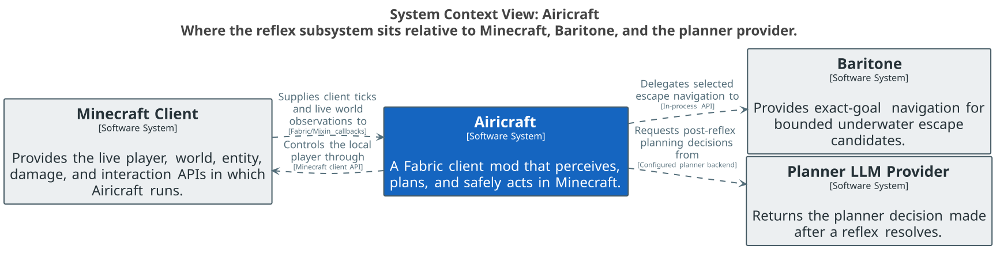
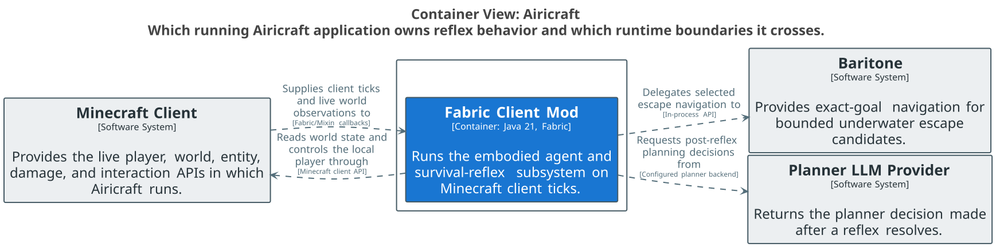
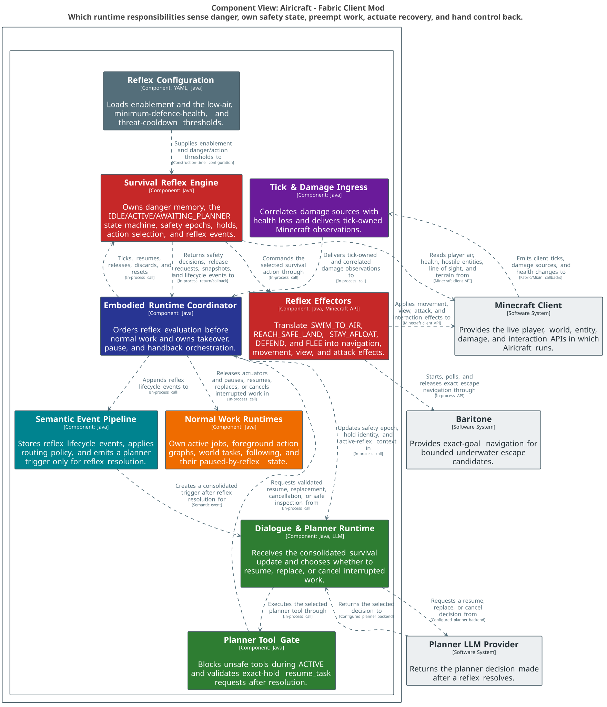
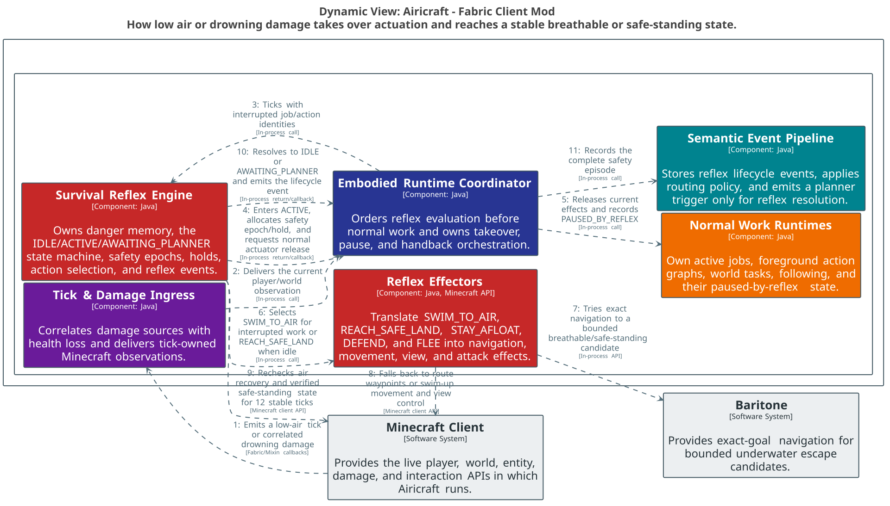
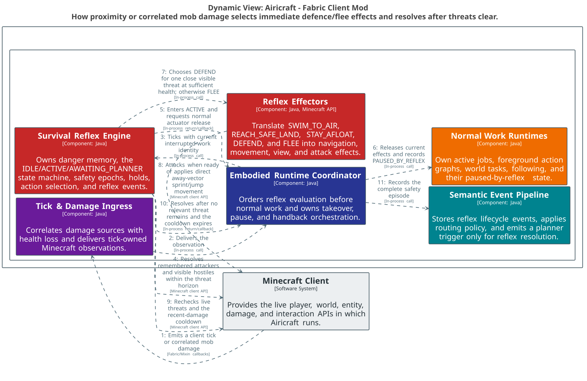
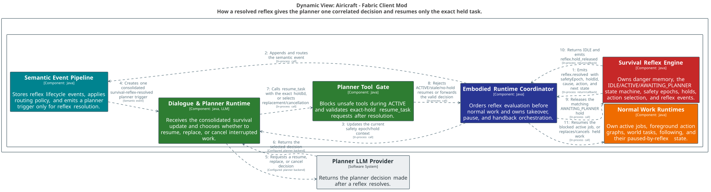

# Airicraft survival reflex architecture

This map documents the current survival-reflex implementation. The canonical model is [`workspace.dsl`](workspace.dsl); each diagram below is a focused projection of that model rather than a separate architecture definition.

## Reading the subsystem

The reflex is an in-process safety layer owned by `EmbodiedAgentRuntime`. It runs before normal jobs and action graphs on every client tick. It does not ask the planner what to do while immediate danger is active: it detects the supported danger, takes actuator ownership, selects a hard-coded survival action, and only returns decision-making to the planner after the danger resolves.

The context view answers: **where does reflex behavior cross the Airicraft boundary?**

The runtime view answers: **which running Airicraft application owns the behavior, and which runtime boundaries does it cross?**

The static component view answers: **which responsibilities sense danger, own safety state, preempt normal work, actuate recovery, and hand control back?**

## State and ownership protocol

| State | Normal work | Reflex actuation | Exit |
| --- | --- | --- | --- |
| `IDLE` | May run | None | Supported danger starts a new safety epoch. |
| `ACTIVE` | Held as `PAUSED_BY_REFLEX` | Always owned by the reflex | Danger resolves to `IDLE` when no work was interrupted, otherwise `AWAITING_PLANNER`. |
| `AWAITING_PLANNER` | Still held | Drowning holds may continue reaching safe land or staying afloat; mob holds do not actuate | Exact `holdId` resume, replacement/cancellation, or automatic safe-land release returns to `IDLE`. |

`safetyEpoch` invalidates stale planner work across reflex episodes. `holdId` correlates a resolution decision to the exact interrupted job/action execution; `resume_task` rejects an active reflex, a missing hold, or a stale hold ID.

## Danger and action policy

| Cause | Detection | Immediate action | Resolution |
| --- | --- | --- | --- |
| Drowning | Drowning damage, or submerged air at/below `lowAirTicks` (default `100`) | `SWIM_TO_AIR` when work was interrupted; otherwise `REACH_SAFE_LAND`. An exhausted safe-land search changes to `STAY_AFLOAT`. | Air recovery must remain stable for 12 ticks. Unsafe idle recovery can retain a safety hold until verified safe standing. |
| Mob attack | A correlated non-player living attacker; or an alive, visible hostile within 8 blocks. Remembered threats remain relevant while alive within 12 blocks, plus the recent-damage cooldown (default `60` ticks). | `DEFEND` only when health, armor, equipped melee weapon, hunger, spare food, threat count/type, distance, line of sight, and terrain are favorable. Otherwise `FLEE` selects dry short-hop Baritone goals; a player already in water uses water-aware safe-standing recovery first. | No relevant threats and no active recent-damage cooldown. |

The drowning and in-water mob-flee paths use bounded world inspection, exact Baritone goals, and waypoint fallback. Dry mob flee scans loaded terrain for dry, hazard-free standing positions with multiple exits, rejects targets that do not increase threat separation, and advances through short exact Baritone hops with an elevated water traversal cost. It no longer presses a raw away vector.

## Runtime stories

The drowning view answers: **how does low air or drowning damage take over actuation and reach a stable breathable or safe-standing state?**

The mob view answers: **how does proximity or correlated damage select immediate defence/flee effects and resolve after threats clear?**

The planner-handback view answers: **how does a resolved reflex create one correlated planner decision and resume only the exact held task?**

## Source evidence

- Sensing and tick order: [`LocalDamageTracker.java`](../../../src/client/java/ai/moeru/airicraft/agent/LocalDamageTracker.java), [`EmbodiedAgentRuntime.java`](../../../src/client/java/ai/moeru/airicraft/agent/EmbodiedAgentRuntime.java)
- State machine, policy, threat memory, events, and holds: [`SurvivalReflexRuntime.java`](../../../src/client/java/ai/moeru/airicraft/agent/reflex/SurvivalReflexRuntime.java), [`SurvivalReflexSnapshot.java`](../../../src/client/java/ai/moeru/airicraft/agent/reflex/SurvivalReflexSnapshot.java)
- Underwater route search/navigation effects: [`MinecraftUnderwaterEscapeController.java`](../../../src/client/java/ai/moeru/airicraft/agent/tasks/MinecraftUnderwaterEscapeController.java), [`UnderwaterEscapeSearch.java`](../../../src/client/java/ai/moeru/airicraft/agent/tasks/UnderwaterEscapeSearch.java), [`UnderwaterEscapeNavigator.java`](../../../src/client/java/ai/moeru/airicraft/agent/tasks/UnderwaterEscapeNavigator.java)
- Normal-work pause/resume: [`ActiveJobRuntime.java`](../../../src/client/java/ai/moeru/airicraft/agent/job/ActiveJobRuntime.java), [`ActionGraphCoordinator.java`](../../../src/client/java/ai/moeru/airicraft/agent/actions/ActionGraphCoordinator.java)
- Planner safety gate and resume tool: [`EmbodiedPlannerActionToolExecutor.java`](../../../src/client/java/ai/moeru/airicraft/agent/EmbodiedPlannerActionToolExecutor.java), [`PlannerToolCatalog.java`](../../../src/client/java/ai/moeru/airicraft/agent/llm/PlannerToolCatalog.java)
- Threshold configuration: [`AgentConfig.java`](../../../src/client/java/ai/moeru/airicraft/agent/AgentConfig.java), [`AgentConfigLoader.java`](../../../src/client/java/ai/moeru/airicraft/agent/AgentConfigLoader.java)

## Boundaries and caveats

- This is a source-grounded current-state map, not a proposed design.
- `SurvivalReflexRuntime` is a cohesive component inside the Fabric client mod, not a separate process or deployable.
- State, threat memory, and queued events are in-memory and reset on runtime/world lifecycle boundaries; no reflex datastore exists.
- Baritone owns mob flee and underwater escape routes. Mob `DEFEND` still uses direct camera, movement, and attack controls after the readiness gate chooses combat.
- Flee target search is bounded to loaded terrain. It avoids locally visible water and hazards but does not provide global shore discovery or guarantee escape from an indefinitely persistent pursuer in a finite enclosure.
- The behavior-tree projection and debug/event history observe the reflex but do not own its decisions, so they are omitted from the focused topology.
