# Airicraft Component Map Implementation Plan

> **For agentic workers:** REQUIRED SUB-SKILL: Use superpowers:subagent-driven-development (recommended) or superpowers:executing-plans to implement this plan task-by-task. Steps use checkbox (`- [ ]`) syntax for tracking.

**Goal:** Build a clustered Graphviz map and companion Markdown index that explain Airicraft's major components, roles, and current runtime relationships without exposing individual files as graph nodes.

**Architecture:** The DOT source is the canonical visual definition and groups 20 conceptual components into control, lifecycle, cognition, execution, world interface, support, addon, and data clusters. A generated SVG provides the durable rendered view, while a Markdown index carries source links, ownership details, and thread boundaries that would overcrowd the diagram.

**Tech Stack:** Graphviz DOT/SVG, Markdown, shell-based structural checks, current Java/Fabric source as evidence.

---

## File Structure

- Create `docs/architecture/airicraft-component-map.md`: component role index,
  reading guide, source anchors, and thread-boundary notes.
- Create `docs/architecture/airicraft-component-map.dot`: canonical clustered
  component graph and labeled relationships.
- Create `docs/architecture/airicraft-component-map.svg`: Graphviz-generated
  rendering; never edit this file by hand.
- Read, but do not modify, the Java entrypoints and data directories listed in
  Task 2 as relationship evidence.

### Task 1: Ensure native Graphviz is available

**Files:**
- Modify: none

- [ ] **Step 1: Check for the DOT renderer**

Run:

```bash
command -v dot
```

Expected on this host before installation: non-zero exit because `dot` is not
installed.

- [ ] **Step 2: Install Graphviz after explicit approval**

Request approval for the external package installation, then run:

```bash
brew install graphviz
```

Expected: Homebrew installs Graphviz and its native dependencies successfully.

- [ ] **Step 3: Verify the renderer**

Run:

```bash
dot -V
```

Expected: exit code `0` and a `graphviz version` line on stderr.

### Task 2: Confirm the relationship evidence

**Files:**
- Read: `src/client/java/ai/moeru/airicraft/AiricraftClient.java`
- Read: `src/client/java/ai/moeru/airicraft/ClientRuntimeController.java`
- Read: `src/client/java/ai/moeru/airicraft/ModBridgeServer.java`
- Read: `src/client/java/ai/moeru/airicraft/agent/EmbodiedAgentRuntime.java`
- Read: `src/client/java/ai/moeru/airicraft/agent/shell/PlannerShellFactory.java`
- Read: `src/client/java/ai/moeru/airicraft/agent/dialogue/DialogueRuntime.java`
- Read: `src/client/java/ai/moeru/airicraft/agent/llm/PlannerOrchestrator.java`
- Read: `src/client/java/ai/moeru/airicraft/agent/actions/ActionGraphExecutionRuntime.java`
- Read: `src/client/java/ai/moeru/airicraft/agent/tasks/WorldTaskExecutor.java`
- Read: `wrapper/src/main/java/ai/moeru/airicraft/wrapper/AiricraftCliMain.java`
- Read: `wrapper/src/main/java/ai/moeru/airicraft/wrapper/HttpBridgeTransport.java`
- Read: `addons/evaluator/src/client/java/ai/moeru/airicraft/evaluator/AiricraftEvaluatorClient.java`
- Read: `addons/evaluator/src/client/java/ai/moeru/airicraft/evaluator/EvaluationAddonRuntime.java`
- Read: `compat/journeymap/src/client/java/ai/moeru/airicraft/compat/journeymap/AiricraftJourneyMapPlugin.java`
- Read: `compat/rei/src/client/java/ai/moeru/airicraft/compat/rei/AiricraftReiPlugin.java`

- [ ] **Step 1: Verify all planned source anchors exist**

Run:

```bash
for path in \
  src/client/java/ai/moeru/airicraft/AiricraftClient.java \
  src/client/java/ai/moeru/airicraft/ClientRuntimeController.java \
  src/client/java/ai/moeru/airicraft/ModBridgeServer.java \
  src/client/java/ai/moeru/airicraft/agent/EmbodiedAgentRuntime.java \
  src/client/java/ai/moeru/airicraft/agent/shell/PlannerShellFactory.java \
  src/client/java/ai/moeru/airicraft/agent/dialogue/DialogueRuntime.java \
  src/client/java/ai/moeru/airicraft/agent/llm/PlannerOrchestrator.java \
  src/client/java/ai/moeru/airicraft/agent/actions/ActionGraphExecutionRuntime.java \
  src/client/java/ai/moeru/airicraft/agent/tasks/WorldTaskExecutor.java \
  wrapper/src/main/java/ai/moeru/airicraft/wrapper/AiricraftCliMain.java \
  wrapper/src/main/java/ai/moeru/airicraft/wrapper/HttpBridgeTransport.java \
  addons/evaluator/src/client/java/ai/moeru/airicraft/evaluator/AiricraftEvaluatorClient.java \
  addons/evaluator/src/client/java/ai/moeru/airicraft/evaluator/EvaluationAddonRuntime.java \
  compat/journeymap/src/client/java/ai/moeru/airicraft/compat/journeymap/AiricraftJourneyMapPlugin.java \
  compat/rei/src/client/java/ai/moeru/airicraft/compat/rei/AiricraftReiPlugin.java; do
  test -f "$path" || exit 1
done
```

Expected: exit code `0` with no output.

- [ ] **Step 2: Reconfirm the critical construction and extension edges**

Run:

```bash
rg -n "new (ClientRuntimeController|ModBridgeServer|EmbodiedAgentRuntime|ActionGraphExecutionRuntime)|BridgeExtensionRegistry.register|MapIntegrationBridge.setProviders|ReiRecipeSearchBridge.setBackend" \
  src/client/java addons/evaluator/src/client/java compat wrapper/src/main/java
```

Expected: matches proving Fabric constructs the controller, the controller owns
the bridge and runtime, the embodied runtime owns the action graph, the evaluator
extends bridge routes, and JourneyMap/REI register through integration bridges.

- [ ] **Step 3: Reconfirm command, tick, and feedback flow**

Run:

```bash
rg -n "END_CLIENT_TICK|onClientTick|dispatchActionGraphPrimitive|worldTaskExecutor.tick|eventPipeline.drain|requestPlannerTool" \
  src/client/java addons/evaluator/src/client/java
```

Expected: matches showing Fabric tick callbacks entering both the main runtime
and evaluator, action-graph primitives reaching world tasks, and events feeding
planner turns.

### Task 3: Write the component role index

**Files:**
- Create: `docs/architecture/airicraft-component-map.md`

- [ ] **Step 1: Create the index with the approved component vocabulary**

Create the document with these sections and component rows:

```markdown
# Airicraft Component Map


This map describes the current runtime wiring at a component level. Solid arrows
show construction, ownership, requests, or command flow. Dashed arrows show
feedback, observation, instrumentation, or optional extension.

## External Control

| Component | Role | Owned by / depends on | Primary entrypoints |
| --- | --- | --- | --- |
| Wrapper CLI | Standalone public command surface; discovers the active bridge and translates commands to HTTP. | Runs outside Minecraft; depends on the bridge discovery file and localhost API. | `AiricraftCliMain`, `HttpBridgeTransport` |
| HTTP bridge | Authenticated localhost protocol boundary; routes external commands and addon endpoints into client services. | Started by `ClientRuntimeController`; extension routes come from `BridgeExtensionRegistry`. | `ModBridgeServer`, `BridgeExtensionRegistry` |

## Client Lifecycle

| Component | Role | Owned by / depends on | Primary entrypoints |
| --- | --- | --- | --- |
| Fabric client entrypoint | Registers lifecycle, tick, render, screen, chat, and disconnect callbacks. | Fabric Loader; delegates lifecycle work to the runtime controller. | `AiricraftClient` |
| Runtime controller | Composition root for bridge, agent runtime, screenshots, camera, highlights, Baritone, and world-task executors. | Constructed once by `AiricraftClient`; recreates the agent runtime on reload. | `ClientRuntimeController` |
| Embodied agent runtime | Tick-driven coordinator for session state, dialogue, planner, events, goals, action graph, world tasks, and debugging. | Constructed by the runtime controller and called on the Minecraft client thread. | `EmbodiedAgentRuntime` |

## Cognition and Context

| Component | Role | Owned by / depends on | Primary entrypoints |
| --- | --- | --- | --- |
| Session and dialogue | Maintains world/session mode and turns incoming chat or internal updates into dialogue effects and planner work. | Owned by the embodied runtime; uses the planner shell. | `SessionRuntime`, `DialogueRuntime`, `PlannerShellFactory` |
| Planner and LLM | Aggregates conversation/world context, calls the configured LLM, validates tool requests, coordinates attempts, and executes planner tools. | Owned through the planner shell; depends on tool providers, vision, and observability. | `PlannerOrchestrator`, `PlannerSessionCoordinator`, `PlannerContextAggregator` |
| Events and semantic context | Buffers domain events, applies event policy, projects world/task changes, and creates planner-visible triggers. | Owned by the embodied runtime; consumes Minecraft, task, and action-graph outcomes. | `AgentEventPipeline`, `SemanticContextProjector`, `PlannerAmbientContext` |

## Execution

| Component | Role | Owned by / depends on | Primary entrypoints |
| --- | --- | --- | --- |
| Action graph | Gets route advice for high-level action goals, tracks execution and recovery state, and dispatches primitive steps. | Owned and ticked by the embodied runtime; uses Airicraft method providers and delegates primitives. | `ActionGraphExecutionRuntime`, `AiricraftPlanAdvisor`, `AutoCommittingRoutePlanner` |
| World tasks | Owns tick-driven task lifecycles for navigation, crafting, smelting, block/entity interaction, and related actions. | Constructed by the runtime controller; invoked by direct planner tools and graph primitives. | `WorldTaskExecutor`, `DispatchingWorldTaskExecutor` |
| Minecraft adapters and control | Applies low-level movement, camera, Baritone, interaction, and mixin-backed game operations. | Used by world-task executors and perception services; acts on Minecraft client state. | `LiveBaritoneFacade`, `MovementController`, `CameraController`, client mixins |

## World Interfaces and Support

| Component | Role | Owned by / depends on | Primary entrypoints |
| --- | --- | --- | --- |
| Perception and integration bridges | Captures screenshots and world/player state and exposes map and recipe-search providers to bridge and planner tools. | Uses Minecraft client state; optional providers are registered by compat addons. | `FirstPersonScreenshotService`, `PlayerViewService`, `MapIntegrationBridge`, `ReiRecipeSearchBridge` |
| Configuration | Loads bridge, camera, social, LLM, action, idle, and observability settings; reload rebuilds agent state. | Loaded by the runtime controller and embodied runtime composition path. | `AiricraftConfigLoader`, `AgentConfigLoader`, `IdleIdeasLoader` |
| Debugging and observability | Records planner calls, state timelines, and spans for bridge inspection, evaluator evidence, and OTLP export. | Cross-cuts the agent runtime and planner; read by bridge/evaluator debug surfaces. | `AgentDebugRecorder`, `LlmFlightRecorder`, `AgentObservability` |

## Addons and Data

| Component | Role | Owned by / depends on | Primary entrypoints |
| --- | --- | --- | --- |
| Evaluator addon | Registers evaluation bridge routes, restores scenario worlds, drives scenarios on client ticks, checks results, and records durable evidence. | Separate Fabric addon; accesses the live runtime through `AiricraftClient.runtimeController()`. | `AiricraftEvaluatorClient`, `EvaluationAddonRuntime`, `ScenarioEvaluationRunner` |
| JourneyMap compatibility | Adapts JourneyMap waypoints and map images into the core map integration registry. | Optional addon loaded by JourneyMap; registers a `MapIntegrationProvider`. | `AiricraftJourneyMapPlugin`, `JourneyMapIntegrationProvider` |
| REI compatibility | Adapts REI's runtime recipe registry into the planner's recipe-search bridge. | Optional REI client plugin; installs and clears the search backend on reload stages. | `AiricraftReiPlugin`, `ReiRuntimeRecipeSearchBackend` |
| Evaluation scenarios | YAML scenario definitions and frozen-world fixtures consumed by the evaluator. | Loaded by the evaluator repository and scenario loader. | `scenarios/`, `EvaluationScenarioLoader` |

## Runtime and Thread Boundaries

- The wrapper is a separate process. It communicates through authenticated
  localhost HTTP using the bridge discovery file.
- Bridge handlers run on HTTP-server threads and marshal world-bound work onto
  the Minecraft client thread.
- Fabric lifecycle callbacks, the main agent tick, evaluator tick, world tasks,
  action graph, camera, and highlights advance from client ticks.
- Planner and vision requests may execute asynchronously; their accepted results
  are reconciled back into tick-owned runtime state.
- Compatibility addons install providers through stable core bridges, so the
  main runtime does not depend directly on JourneyMap or REI classes.
```

Replace the backticked entrypoint names with relative Markdown links whose
targets are the corresponding entries in this exact list:

```text
../../wrapper/src/main/java/ai/moeru/airicraft/wrapper/AiricraftCliMain.java
../../wrapper/src/main/java/ai/moeru/airicraft/wrapper/HttpBridgeTransport.java
../../src/client/java/ai/moeru/airicraft/ModBridgeServer.java
../../src/client/java/ai/moeru/airicraft/bridge/BridgeExtensionRegistry.java
../../src/client/java/ai/moeru/airicraft/AiricraftClient.java
../../src/client/java/ai/moeru/airicraft/ClientRuntimeController.java
../../src/client/java/ai/moeru/airicraft/agent/EmbodiedAgentRuntime.java
../../src/client/java/ai/moeru/airicraft/agent/session/SessionRuntime.java
../../src/client/java/ai/moeru/airicraft/agent/dialogue/DialogueRuntime.java
../../src/client/java/ai/moeru/airicraft/agent/shell/PlannerShellFactory.java
../../src/client/java/ai/moeru/airicraft/agent/llm/PlannerOrchestrator.java
../../src/client/java/ai/moeru/airicraft/agent/llm/PlannerSessionCoordinator.java
../../src/client/java/ai/moeru/airicraft/agent/llm/PlannerContextAggregator.java
../../src/client/java/ai/moeru/airicraft/agent/events/AgentEventPipeline.java
../../src/client/java/ai/moeru/airicraft/agent/semantic/SemanticContextProjector.java
../../src/client/java/ai/moeru/airicraft/agent/llm/PlannerAmbientContext.java
../../src/client/java/ai/moeru/airicraft/agent/actions/ActionGraphExecutionRuntime.java
../../src/client/java/ai/moeru/airicraft/agent/actions/AiricraftPlanAdvisor.java
../../src/client/java/ai/moeru/airicraft/agent/actions/AutoCommittingRoutePlanner.java
../../src/client/java/ai/moeru/airicraft/agent/tasks/WorldTaskExecutor.java
../../src/client/java/ai/moeru/airicraft/agent/tasks/DispatchingWorldTaskExecutor.java
../../src/client/java/ai/moeru/airicraft/agent/baritone/LiveBaritoneFacade.java
../../src/client/java/ai/moeru/airicraft/agent/control/MovementController.java
../../src/client/java/ai/moeru/airicraft/agent/control/CameraController.java
../../src/client/java/ai/moeru/airicraft/mixin/client/
../../src/client/java/ai/moeru/airicraft/FirstPersonScreenshotService.java
../../src/client/java/ai/moeru/airicraft/PlayerViewService.java
../../src/client/java/ai/moeru/airicraft/agent/integration/map/MapIntegrationBridge.java
../../src/client/java/ai/moeru/airicraft/agent/integration/rei/ReiRecipeSearchBridge.java
../../src/client/java/ai/moeru/airicraft/AiricraftConfigLoader.java
../../src/client/java/ai/moeru/airicraft/agent/AgentConfigLoader.java
../../src/client/java/ai/moeru/airicraft/agent/idle/IdleIdeasLoader.java
../../src/client/java/ai/moeru/airicraft/agent/debug/AgentDebugRecorder.java
../../src/client/java/ai/moeru/airicraft/agent/debug/LlmFlightRecorder.java
../../src/client/java/ai/moeru/airicraft/agent/observability/AgentObservability.java
../../addons/evaluator/src/client/java/ai/moeru/airicraft/evaluator/AiricraftEvaluatorClient.java
../../addons/evaluator/src/client/java/ai/moeru/airicraft/evaluator/EvaluationAddonRuntime.java
../../addons/evaluator/src/client/java/ai/moeru/airicraft/agent/evaluation/ScenarioEvaluationRunner.java
../../compat/journeymap/src/client/java/ai/moeru/airicraft/compat/journeymap/AiricraftJourneyMapPlugin.java
../../compat/journeymap/src/client/java/ai/moeru/airicraft/compat/journeymap/JourneyMapIntegrationProvider.java
../../compat/rei/src/client/java/ai/moeru/airicraft/compat/rei/AiricraftReiPlugin.java
../../compat/rei/src/client/java/ai/moeru/airicraft/compat/rei/ReiRuntimeRecipeSearchBackend.java
../../scenarios/
../../addons/evaluator/src/client/java/ai/moeru/airicraft/agent/evaluation/EvaluationScenarioLoader.java
```

Verify every resolved target with `test -e`.

- [ ] **Step 2: Validate source links and document structure**

Run:

```bash
rg -n "^## |^\| Component|airicraft-component-map\.svg" docs/architecture/airicraft-component-map.md
rg -n "AiricraftClient|ClientRuntimeController|EmbodiedAgentRuntime|ActionGraphExecutionRuntime|EvaluationAddonRuntime|AiricraftJourneyMapPlugin|AiricraftReiPlugin" docs/architecture/airicraft-component-map.md
```

Expected: all seven section headings, the SVG embed, table headers, and every
major runtime/addon anchor are present.

- [ ] **Step 3: Commit the component index**

```bash
git add docs/architecture/airicraft-component-map.md
git commit -m "docs(architecture): map component roles"
```

### Task 4: Create and render the clustered Graphviz map

**Files:**
- Create: `docs/architecture/airicraft-component-map.dot`
- Create: `docs/architecture/airicraft-component-map.svg`

- [ ] **Step 1: Write the canonical DOT graph**

Write this complete DOT source. Small rank or routing adjustments are allowed
during visual QA, but node IDs, node roles, and relationship labels must remain
semantically unchanged unless current source evidence contradicts them.

```dot
digraph Airicraft {
  graph [
    rankdir=LR,
    compound=true,
    newrank=true,
    splines=polyline,
    nodesep=0.38,
    ranksep=0.72,
    pad=0.25,
    bgcolor="transparent",
    fontname="Helvetica",
    fontsize=12,
    labelloc=t,
    label="Airicraft Component Map"
  ];
  node [
    shape=box,
    style="rounded,filled",
    color="#5f6b7a",
    fillcolor="#ffffff",
    fontname="Helvetica",
    fontsize=10,
    margin="0.14,0.09"
  ];
  edge [
    color="#475569",
    fontcolor="#334155",
    fontname="Helvetica",
    fontsize=8,
    arrowsize=0.72,
    penwidth=1.2
  ];

  subgraph cluster_control {
    label="External Control";
    color="#93c5fd";
    fillcolor="#eff6ff";
    style="rounded,filled";
    wrapper_cli [component=true, label=<<B>Wrapper CLI</B><BR/><FONT POINT-SIZE="9">Public command surface</FONT>>];
    http_bridge [component=true, label=<<B>HTTP Bridge</B><BR/><FONT POINT-SIZE="9">Local protocol boundary</FONT>>];
  }

  subgraph cluster_lifecycle {
    label="Client Lifecycle";
    color="#86efac";
    fillcolor="#f0fdf4";
    style="rounded,filled";
    fabric_entry [component=true, label=<<B>Fabric Entrypoint</B><BR/><FONT POINT-SIZE="9">Registers client callbacks</FONT>>];
    runtime_controller [component=true, label=<<B>Runtime Controller</B><BR/><FONT POINT-SIZE="9">Composition and lifecycle root</FONT>>];
    agent_runtime [component=true, label=<<B>Embodied Agent Runtime</B><BR/><FONT POINT-SIZE="9">Tick-owned agent coordinator</FONT>>];
  }

  subgraph cluster_cognition {
    label="Cognition and Context";
    color="#c4b5fd";
    fillcolor="#f5f3ff";
    style="rounded,filled";
    session_dialogue [component=true, label=<<B>Session and Dialogue</B><BR/><FONT POINT-SIZE="9">State, chat, and turn effects</FONT>>];
    planner_llm [component=true, label=<<B>Planner and LLM</B><BR/><FONT POINT-SIZE="9">Reasoning and tool orchestration</FONT>>];
    events_context [component=true, label=<<B>Events and Semantic Context</B><BR/><FONT POINT-SIZE="9">Policy, projection, and triggers</FONT>>];
  }

  subgraph cluster_execution {
    label="Execution";
    color="#fdba74";
    fillcolor="#fff7ed";
    style="rounded,filled";
    action_graph [component=true, label=<<B>Action Graph</B><BR/><FONT POINT-SIZE="9">Resolve and run action goals</FONT>>];
    world_tasks [component=true, label=<<B>World Tasks</B><BR/><FONT POINT-SIZE="9">Tick-driven task lifecycles</FONT>>];
    minecraft_adapters [component=true, label=<<B>Minecraft Adapters</B><BR/><FONT POINT-SIZE="9">Baritone, movement, interaction</FONT>>];
  }

  subgraph cluster_world {
    label="World Interfaces";
    color="#67e8f9";
    fillcolor="#ecfeff";
    style="rounded,filled";
    perception_integrations [component=true, label=<<B>Perception and Integrations</B><BR/><FONT POINT-SIZE="9">Views, map, and recipe access</FONT>>];
    minecraft_client [component=true, shape=component, label=<<B>Minecraft Client</B><BR/><FONT POINT-SIZE="9">Authoritative game state</FONT>>];
  }

  subgraph cluster_support {
    label="Support";
    color="#cbd5e1";
    fillcolor="#f8fafc";
    style="rounded,filled";
    configuration [component=true, label=<<B>Configuration</B><BR/><FONT POINT-SIZE="9">Runtime and agent settings</FONT>>];
    observability [component=true, label=<<B>Debug and Observability</B><BR/><FONT POINT-SIZE="9">Timeline, calls, and spans</FONT>>];
  }

  subgraph cluster_addons {
    label="Addons";
    color="#f9a8d4";
    fillcolor="#fdf2f8";
    style="rounded,filled";
    evaluator [component=true, label=<<B>Evaluator Addon</B><BR/><FONT POINT-SIZE="9">Scenarios, checks, evidence</FONT>>];
    journeymap_compat [component=true, label=<<B>JourneyMap Compat</B><BR/><FONT POINT-SIZE="9">Map provider adapter</FONT>>];
    rei_compat [component=true, label=<<B>REI Compat</B><BR/><FONT POINT-SIZE="9">Recipe backend adapter</FONT>>];
  }

  subgraph cluster_data {
    label="Data-Driven Assets";
    color="#fde047";
    fillcolor="#fefce8";
    style="rounded,filled";
    evaluation_scenarios [component=true, shape=folder, label=<<B>Evaluation Scenarios</B><BR/><FONT POINT-SIZE="9">YAML configs and fixtures</FONT>>];
  }

  wrapper_cli -> http_bridge [label="authenticated HTTP"];
  fabric_entry -> runtime_controller [label="lifecycle + ticks"];
  runtime_controller -> http_bridge [label="owns / starts"];
  runtime_controller -> agent_runtime [label="constructs / ticks"];
  http_bridge -> runtime_controller [label="runtime + world routes"];
  http_bridge -> perception_integrations [label="queries / capture"];
  agent_runtime -> session_dialogue [label="coordinates"];
  session_dialogue -> planner_llm [label="turns + triggers"];
  events_context -> planner_llm [label="context + events", style=dashed];
  planner_llm -> action_graph [label="tools + action goals"];
  planner_llm -> world_tasks [label="direct task tools"];
  action_graph -> world_tasks [label="primitive dispatch"];
  action_graph -> events_context [label="progress + outcomes", style=dashed];
  world_tasks -> minecraft_adapters [label="tick-driven commands"];
  world_tasks -> events_context [label="task outcomes", style=dashed];
  minecraft_adapters -> minecraft_client [label="game actions"];
  minecraft_client -> perception_integrations [label="world + player state", style=dashed];
  perception_integrations -> events_context [label="observations", style=dashed];
  configuration -> runtime_controller [label="loads / reloads"];
  agent_runtime -> observability [label="records state", style=dashed];
  planner_llm -> observability [label="calls + spans", style=dashed];
  evaluator -> http_bridge [label="extension routes", style=dashed];
  evaluator -> agent_runtime [label="drives + inspects"];
  evaluation_scenarios -> evaluator [label="scenario + fixture data"];
  journeymap_compat -> perception_integrations [label="map provider", style=dashed];
  rei_compat -> perception_integrations [label="recipe backend", style=dashed];

  subgraph cluster_legend {
    label="Relationship Key";
    color="#d1d5db";
    style="rounded,dashed";
    legend_solid_a [shape=plaintext, label="control / request"];
    legend_solid_b [shape=plaintext, label="target"];
    legend_dashed_a [shape=plaintext, label="feedback / extension"];
    legend_dashed_b [shape=plaintext, label="target"];
    legend_solid_a -> legend_solid_b [label="solid"];
    legend_dashed_a -> legend_dashed_b [label="dashed", style=dashed];
  }
}
```



- [ ] **Step 2: Render the SVG**

Run:

```bash
dot -Tsvg docs/architecture/airicraft-component-map.dot \
  -o docs/architecture/airicraft-component-map.svg
```

Expected: exit code `0` and a non-empty SVG.

- [ ] **Step 3: Run structural Graphviz checks**

Run:

```bash
test -s docs/architecture/airicraft-component-map.svg
xmllint --noout docs/architecture/airicraft-component-map.svg
dot -Tdot docs/architecture/airicraft-component-map.dot -o /tmp/airicraft-component-map.normalized.dot
```

Expected: all commands exit `0` with no Graphviz syntax errors or XML errors.

- [ ] **Step 4: Inspect a raster preview**

Run:

```bash
dot -Tpng -Gdpi=144 docs/architecture/airicraft-component-map.dot \
  -o /tmp/airicraft-component-map.png
```

Inspect `/tmp/airicraft-component-map.png` with the available image viewer.
Expected: every node label is readable, arrow directions are unambiguous, no
label is clipped, and the planner-to-execution-to-feedback loop is visually
traceable. If not, adjust ranks, cluster placement, or edge routing in the DOT
source and repeat Steps 2 through 4.

- [ ] **Step 5: Commit the canonical graph and rendering**

```bash
git add docs/architecture/airicraft-component-map.dot \
  docs/architecture/airicraft-component-map.svg
git commit -m "docs(architecture): add component graph"
```

### Task 5: Verify reproducibility and final scope

**Files:**
- Verify: `docs/architecture/airicraft-component-map.md`
- Verify: `docs/architecture/airicraft-component-map.dot`
- Verify: `docs/architecture/airicraft-component-map.svg`

- [ ] **Step 1: Prove the SVG is reproducible from DOT**

Run:

```bash
dot -Tsvg docs/architecture/airicraft-component-map.dot \
  -o /tmp/airicraft-component-map.svg
cmp docs/architecture/airicraft-component-map.svg \
  /tmp/airicraft-component-map.svg
```

Expected: `cmp` exits `0`.

- [ ] **Step 2: Check the component-level scope**

Run:

```bash
node_count=$(rg -c 'component=true' docs/architecture/airicraft-component-map.dot)
test "$node_count" -ge 15
test "$node_count" -le 20
```

Expected: exit code `0`; the map stays between 15 and 20 conceptual nodes.

- [ ] **Step 3: Check required addons and flows are represented**

Run:

```bash
for term in \
  evaluator journeymap_compat rei_compat action_graph planner_llm \
  world_tasks observability evaluation_scenarios; do
  rg -q "$term" docs/architecture/airicraft-component-map.dot || exit 1
done
```

Expected: exit code `0`.

- [ ] **Step 4: Check for accidental unrelated changes**

Run:

```bash
git status --short
git log -3 --oneline
```

Expected: the component-map commits contain only the three approved architecture
artifacts. Existing unrelated `.ua/`, `docs/.obsidian/`, and
`docs/airicraft-agent-coherence-failure-modes.md` changes remain unstaged.
