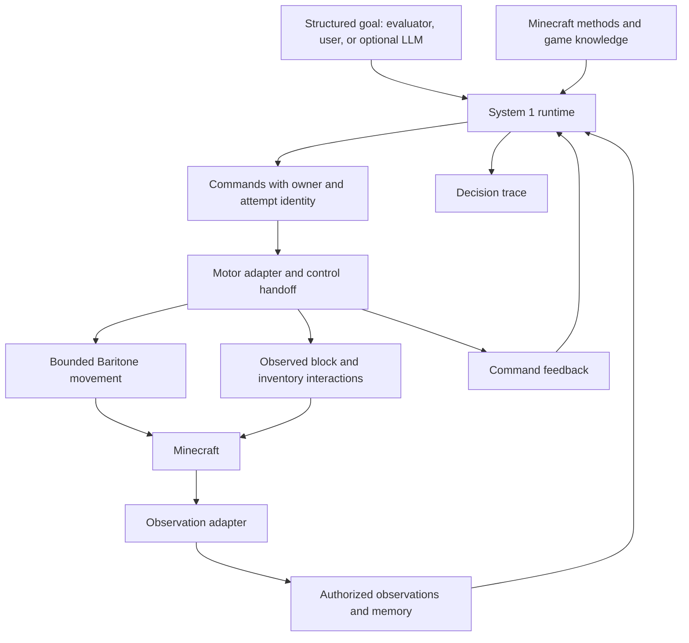

# Deterministic System 1 redesign

Date: 2026-09-06. Status: proposed implementation plan; runtime changes are not implemented by this document.

## Outcome and design commitments

Build a deterministic agent that can pursue a structured goal, discover resources, satisfy dependencies, recover from interruptions, and eventually finish Minecraft without an LLM. Use `iron-pickaxe` as the first integrated sanity check. Game completion is a sequence of later capability milestones, not evidence that one successful seed establishes a good architecture.

Design the runtime from these requirements. Existing classes, action graphs, planner tools, and the advisor library are migration inputs, not constraints on the target design.

The main commitments are:

1. One runtime owns goal decomposition, task lifetimes, interruption, resumption, and ordinary recovery.
2. Airicraft selects acquisition methods, exploration frontiers, individual targets, and interaction positions. Baritone supplies bounded movement.
3. Actual observations, remembered observations, and game priors remain distinct. Loaded hidden blocks are not observations.
4. Lighting is a maintained preference with explicit, bounded relaxation. Perception rules do not relax with it.
5. Game knowledge is an explicit Minecraft module. The generic runtime knows task lifecycle and scheduling, not ores, torches, coordinates, or recipes.
6. Decisions consume recorded values and return effects to execute. The same decision interface supports live execution and offline replay.
7. An LLM may interpret requests or propose a new strategy later. Known gameplay does not require one, and no-LLM mode cannot silently fall back to one.

## Evidence motivating the replacement

The first no-LLM `iron-pickaxe` run reached a stone pickaxe, then failed because iron mining met the illumination guard with zero torches. The harness completed and the flight log identified the guard; the Recorder Play was finalized and its ZIP validated, but playback was not visually reviewed. See [the recorded baseline](../../no-llm-evaluation.md).

Current source confirms several ownership problems:

- `LiveBaritoneFacade.startMine` calls `mineByName`, giving Baritone target discovery and mining strategy.
- `ActionGraphCoordinator.submit` rejects another foreground goal with `foreground_busy`. Its passive watch mechanism does not express a parent task interrupted by a resupply child.
- `EmbodiedAgentRuntime` combines observation, graph coordination, primitive admission, and other runtime concerns. Its nearby-block scan exposes loaded terrain without a visibility contract.
- `BlockBreakTaskExecutor` supports exact coordinates, but uses a fixed face and does not establish an aimed, visible interaction.
- Global Baritone settings permit breaking and placing; selecting an exact destination alone does not bound its effects or information use.

This proposal deliberately supersedes the committed-plan ownership described in [Action Plan Advisor Boundary](../../action-plan-advisor.md): routine missing requirements and recoverable failures become System 1 responsibilities instead of terminal `REPLAN_REQUIRED` handoffs. It also replaces the graph-owned execution prescription in the older [action graph design](../specs/2026-06-16-action-graph-architecture-solidification.md). Update those documents when the replacement becomes active; do not describe the proposed architecture as already deployed.

## Target modules and ownership



| Module | Owns | Does not own |
| --- | --- | --- |
| System 1 runtime | Task tree, selected method, dependencies, interruption, budgets, result propagation, command ownership | Minecraft rules, world reads, LLM calls |
| Minecraft domain | Goal predicates, method alternatives, resource accounting, acquisition strategy, risk policies | Input devices, asynchronous executor lifecycle |
| Observation adapter and memory | Allowed sensing, observation provenance, last-seen facts, forgetting and invalidation | Choosing resource strategies, revealing hidden blocks |
| Motor adapter | Executing one authorized command, bounded progress, cancellation acknowledgement, engine integration | Selecting ore deposits, obtaining resources, resupply policy |
| Host integration | Goal submission, tick input, command/result delivery, status and trace export | Another task scheduler or recovery policy |

Implement these as a small set of cohesive packages initially. The pure runtime can use domain-supplied value types without importing Minecraft or Baritone. Do not build a plugin loader, scripting language, general theorem prover, or separate framework repository first.

The central decision interface is conceptually:

```text
advance(runtimeState, observations, commandResults, tick, policy)
    -> nextRuntimeState, commands, decisionEvents
```

Domain methods are deterministic functions called by this runtime. Live game objects, wall clocks, provider clients, and mutable engine handles never cross that interface. Time is an explicit tick input; tie breaking is stable. If randomness becomes useful, pass and record its seed/state.

The host translates values and executes effects on the correct game thread. Expensive bounded computations may run off-thread over immutable inputs; their results carry an input revision and cannot commit against a newer incompatible state. Start synchronously with a measured per-tick work limit and resumable search before adding worker coordination.

## Task model: reactive hierarchy with explicit continuations

Use a reactive task tree. A task represents an intended outcome and a selected method for reaching it. It retains its identity and progress while children satisfy dependencies or repair operating conditions. Avoid compiling an entire playthrough into a fixed primitive list.

A task frame contains a stable task ID, goal, selected method and local progress, parent relationship, relevant resource commitments, and its remaining work/recovery budgets. Represent its lifecycle as mutually exclusive states with the data each state needs:

- `Ready`: can choose or continue a method.
- `Acting(commandId, attemptId)`: owns a running command.
- `Releasing(commandId, continuation)`: waiting for the motor to relinquish control.
- `WaitingForChild(childId, continuation)`: dependency or repair task is active.
- `WaitingForObservation(condition, deadline)`: external progress such as smelting.
- `Suspended(reason, continuation)`: preempted by a higher priority task.
- `Succeeded(evidence)`, `Failed(reason, evidence)`, or `Cancelled(reason)`.

These are conceptual states, not a mandate for one class per bullet. Choose the smallest typed representation that prevents impossible combinations. One scheduler owns transitions. Executors report progress and outcomes; they never start unrelated tasks.

The first scheduler supports one root mission and one active actuation owner. Passive conditions can continue to be observed while the player does other work. Keep multiple independent user missions and parallel crafting optimization out of the initial implementation.

### Interrupt, repair, and resume

For the user's cave example:

1. `AcquireIron` selects `ExploreCave`, which retains the cave entrance, explored frontiers, chosen frontier, and a remembered return route.
2. The lighting policy requests resupply before advancing further.
3. The runtime retains that continuation and requests safe release of the movement command.
4. After release acknowledgement, it starts one `EnsureLightingSupply` child. That child can craft locally, use another supported light source, or return to obtain materials.
5. Once the supply outcome is observed, the parent revalidates its frontier and route. It schedules return travel if needed, then continues exploration from current observations.

Resuming means preserving the purpose and useful progress, not replaying stale movement coordinates. If the cave is blocked or dangerous now, select another route or method while retaining the iron goal.

A child failure returns structured evidence to its parent. The parent may choose a different method, relax an eligible preference, or fail with exhausted alternatives. It does not immediately fail the entire mission. Identical repair requests reuse the existing child; only one repair for the same condition is outstanding.

### Control and recovery invariants

- At most one owner can issue movement, look, attack, use, or inventory effects. Initially serialize these through one motor lease rather than inventing several interacting locks.
- Every command/result includes task, attempt, and world-session identity. Late results cannot complete a replacement attempt.
- Normal preemption waits for acknowledged release. Timeouts do not grant a second owner permission to act.
- Immediate survival actions need a defined emergency handoff: revoke and neutralize the previous controller before applying survival input. If the adapter cannot guarantee this, treat it as an adapter defect, not concurrent control.
- Release must cover held keys, attack/use state, pathing, and inventory cursor/container state. Mid-click cancellation reconciles actual inventory before retrying.
- Actual observations determine success. A path ending or a click succeeding is not proof that the requested item was obtained.
- World change invalidates pending commands and world-specific memory. Cancellation cleans up descendants and their commitments.
- Budgets bound repeated failures and task depth. Retries require a plausible cause of progress, such as a changed observation, a different target, or a different method.

Emergency policy runs before ordinary work. Maintained-condition repairs rank above mission progress, subject to their own feasibility and budgets. Hysteresis and minimum useful progress prevent repeated pause/resume oscillation. Retain useful survival mechanics from existing code, but move their priority decisions into this scheduler and their physical effects behind the motor lease.

## Game knowledge and deterministic planning

Separate three kinds of information:

| Kind | Example | Treatment |
| --- | --- | --- |
| Observation | A visible ore face at a position; current inventory; open furnace contents | World-scoped evidence, with observation time and source |
| Remembered observation | An entrance or workstation seen earlier | Can motivate travel; must be revalidated before interaction |
| Prior or rule | Stone is plausibly below soil; a recipe transforms inputs; a fuel burns for some duration | Versioned domain knowledge; never fabricates a world coordinate |

Methods offer alternatives such as collect a visible drop, harvest an observed block, explore a frontier, excavate locally, craft, or smelt. Each method describes applicability, requirements, predicted costs, progress state, and failure alternatives. The runtime selects among a bounded set using deterministic ordering and commits to a short execution horizon. Reconsider on meaningful evidence changes or failure, not every tick.

Use recipe and resource dependency search where it fits, with cycle detection and inventory accounting. Do not use a recipe graph as the model for spatial exploration. Exploration methods retain their own frontier and search progress while using the same task lifecycle.

The Minecraft module initially supplies:

- Recipes, alternative ingredients, yields, tool requirements, fuel values, workstations, and harvesting capabilities, preferably derived from the active game's registries and recipe data.
- Heuristics for resource locations, safe excavation, exploration, lighting, food, and survival.
- Resource commitments: distinguish consumable ingredients from reusable tools/stations, account for output yields and usable fuel, and avoid spending an input already needed by a pending task.
- Explanations of infeasibility and alternative methods, including bootstrap cycles such as torches requiring fuel while fuel acquisition appears to require torches.

Changing a modpack should change data and, where mechanics differ, domain methods. It cannot be promised as configuration-only support for arbitrary mechanics. Prove that the runtime is game-independent using a tiny synthetic domain with different resources and an analogous resupply interruption; that proves lifecycle reuse, not support for a second real game. Extract a standalone library only when a real second consumer needs it.

The existing advisor is optional reusable search code. Retain it only if it cleanly fits bounded dependency solving; do not preserve its command model or its separate state ownership to avoid deleting work.

## Fair perception and local excavation

Define the perception contract before optimizing resource acquisition:

- World facts exposed to decisions come from bounded sensing at the player's pose, with line of sight and occlusion. Orientation changes are real look commands.
- A first implementation may use ray casts and engine block identities for exposed surfaces. This is geometric sensing, not screenshot recognition or proof of human-equivalent vision.
- Brightness affects what can be newly identified. Encode a deterministic, configurable visibility model and label dark geometry as uncertain rather than reporting exact ore identities in complete darkness.
- Previously observed places remain available in memory with age and provenance. Hidden changes do not update that memory until observed again.
- Unknown space remains unknown. Debug scans, evaluator ground truth, minimap caches, hidden entity lists, and internal recorder data cannot feed runtime decisions.
- Commands using remembered targets revalidate current reach, visibility, block face/state, and tool eligibility at execution.

Darkness relaxation permits a bounded action under uncertainty. It does not widen the sensing interface. A short move along a remembered corridor or toward an observed exit can be allowed when a newly hidden ore identity cannot be acquired.

For nearby stone under grass, `AcquireStone` compares an observed exposed deposit with a bounded local excavation method. The latter selects an observed surface and opens a shallow stepped cut one visible block at a time, with stable footing and a return path. After each break it observes the newly exposed surfaces and replans locally. It never chooses the coordinates of unseen stone or digs straight beneath its feet.

Score alternatives using expected travel, excavation work, tool cost, uncertainty, and policy risk. Penalize long travel and set a local search budget so a distant cave cannot absorb the task indefinitely. If local excavation fails to expose stone within its budget, retain that failure evidence and try another candidate. Do not encode the stone fixture's buried layout into the method.

### Baritone contract and the hard feasibility gate

Expose commands resembling `NavigateTo(selectedStance, limits)`, `BreakObservedBlock(target)`, `PlaceAtObservedFace(target)`, `Interact(target)`, and `Stop(commandId)`. Crafting/container operations may remain cohesive commands with explicit outcomes. Resource acquisition is a domain task, never a `mineByName` motor command.

Navigation limits include a spatial corridor or region, travel/work budget, deadline, and break/place permissions. Default travel does not modify terrain; excavation tasks authorize individual observed modifications. Keep settings scoped to the active command and restore them on release.

Use Baritone's public goal/process and cancellation interfaces first. The exact hooks needed to enforce the perception contract remain an implementation question. Audit its path search, block-state reads, cached terrain, and movement costs. A visible destination and `legitMine` are insufficient.

The preferred integration supplies path calculation with an authorized terrain view: observed geometry plus explicit unknown cells, with unknown space blocking ordinary route search. Exploration advances that view through observation. Hidden terrain must not influence path costs or candidate selection either.

If public interfaces cannot enforce this, use a narrow internal hook or a maintained Baritone patch. Keep that patch confined to terrain access and request constraints where possible. If this proves too invasive, evaluate an Airicraft local route planner over observed geometry with reusable Baritone movement machinery. This is a decision gate before expanding gameplay, not permission to silently ship unrestricted pathing or a promise that a small hook will suffice.

## Lighting as a maintained preference

The Minecraft lighting policy consumes current illumination/visibility, expected near-term activity, available supplies, remembered retreat options, nearby observed hazards, and active relaxation budget. Keep sensory visibility and preferred working light as separate quantities.

Its outcomes are: continue, place available light, repair supply, permit bounded reduced-light progress, or retreat/choose another method. The generic scheduler sees a repair or temporary policy allowance; it knows nothing about torches.

Supply repair evaluates actual alternatives: craft torches from existing inputs, obtain surface materials and make charcoal, use a modpack-supported light source, or return to a stocked location. Reserve enough fuel and ingredients for the selected production chain. Detect prerequisite cycles before repeatedly creating children. If no repair is affordable, consider a limited relaxation or another acquisition method instead of recursively requesting torches forever.

A relaxation is scoped to a task, reason, allowed activity/region, and bounded time or travel exposure. It expires on budget exhaustion, material hazard change, or restored lighting. It never persists as a global `allowUnilluminated` flag. A favorable case might allow a short stretch through a remembered low-light corridor; deteriorating health or an observed hazard can trigger retreat sooner.

Use separate entry/exit thresholds and replenish above the immediate placement need to avoid stopping for one torch at every step. Thresholds and exposure budgets are policy parameters measured through evaluation, not universal constants guessed into the scheduler. Do not make lighting a hard precondition for every underground primitive.

## Flight recorder as a debugging interface

Record the values that explain decisions from the first implementation slice:

- Run/session, task/parent, command/attempt, tick, and input revision.
- Goal, selected method, candidate scores/rejection reasons, and evidence references.
- Observation additions/invalidation, memory references, and game-knowledge/policy version.
- Interrupt cause, saved continuation, child creation/result, and resume decision.
- Lighting repairs and relaxation scope, consumption, expiration, and reason.
- Command limits, progress, release acknowledgement, failure, and actual postcondition.

Use the existing runtime flight-log export where possible. Store an initial decision-state snapshot plus ordered inputs/deltas sufficient to replay the pure runtime, including feedback and any random state. Decision replay checks the recorded decisions; it does not recreate Minecraft physics or establish that sensors were fair.

Replay/export must report missing input ranges and truncation instead of claiming reproducibility. Add a compact failure report showing the active task chain, last meaningful progress, and exhausted alternatives. Avoid persisting credentials or unrelated chat payloads in these records.

Battle-test this workflow with deliberately introduced failures: remove an observed target, exhaust torches halfway into a cave, block a remembered route, and delay or duplicate motor feedback. For each case, diagnose the cause from saved evidence before adding new logging, then reproduce it through the smallest faithful test and a live scenario. Review at least one Recorder Play visually; ZIP integrity is not playback proof.

Preserve [ADR-0001](../../adr/0001-use-an-external-recording-profile.md): the external recording profile remains independent supporting evidence, and scenario outcome stays distinct from harness outcome. This plan uses runtime-local tick identities and the existing Recorder Play artifact. Precise cross-recorder tick alignment or derived recorder artifacts would require an explicit ADR revision and are not prerequisites for this runtime redesign.

## Implementation sequence and acceptance gates

Each stage should be a reviewable series of logical commits. Do not implement the full design before the first live proof.

### 1. Establish the executable contracts

Create the new runtime package, task/command identities, value transition interface, minimal domain-method interface, and trace records. Wire a launch-time runtime selector so the new implementation can run in isolation. Retain the existing no-LLM provider disconnection and structured evaluator goal submission.

Add a synthetic domain that demonstrates dependency completion, repair interruption, parent continuation, cancellation, stale feedback rejection, and bounded failure. Test outcomes and ownership through the runtime interface. Extend the evaluator report with selected runtime and knowledge/policy versions.

**Gate:** deterministic replay yields the same commands and task transitions; no duplicate command owner; no LLM calls at the provider boundary. Existing `iron-pickaxe` remains the recorded reference failure until the new vertical slice is ready.

### 2. Prove fair local stone acquisition

Implement authorized observation/memory, precise visible breaking and drop collection, the bounded navigation adapter, and `AcquireStone` with exposed-target and local-excavation methods. Resolve the Baritone terrain-access gate in this stage.

Add a fixture with shallow stone under observed soil and a distant cave opening, plus variants with visible stone, obstructed reach, changed targets, and no stone within the excavation budget. Fixture ground truth is evaluator-only.

**Gate:** the agent obtains cobblestone locally within fixture-declared travel/work limits, with zero MineProcess acquisition calls and a trace linking each break to an eligible observation. A paired-world test changes only hidden resource layouts: observations and commands remain identical until differing terrain becomes observable. Exercise the real path adapter as well as pure decisions; audit hidden reads because paired tests alone cannot prove their absence.

### 3. Complete resource production without LLM control

Add log harvesting, tool progression, recipe expansion, workstation handling, smelting, fuel selection, and resource commitments through the new method interface. Use existing interaction mechanics only where they satisfy the new command contract. Add passive furnace waits without creating another scheduler.

**Gate:** exposed-resource fixtures reach an iron pickaxe through observed inventory outcomes; alternative ingredients and fuel shortages choose supported alternatives or terminate with useful evidence. No LLM recovery, hidden-target discovery, or unbounded retry.

### 4. Prove cave interruption and lighting recovery

Add cave-frontier exploration and shallow/deeper excavation methods, lighting maintenance, resupply children, return continuations, bounded relaxation, and survival preemption. Wire all their physical effects through the same motor lease.

**Gate:** a live fixture exhausts torches mid-cave, records one resupply interruption, obtains supplies, returns, and resumes the original exploration purpose. Separate fixtures prove local crafting, charcoal bootstrap, unavailable repair, bounded low-light progress, hazard-driven retreat, and a changed return route. Inventory final state alone cannot pass these behavioral checks.

### 5. Pass the actual iron-pickaxe sanity check and test diagnosis

Run the existing `iron-pickaxe` scenario from its original starting conditions with the new runtime and recorder enabled. Use the diagnostic process above for each failure rather than weakening checks to force a pass.

Add a fixed development set and a separately held-out set covering resource placement, caves, terrain, light, and interruptions. Freeze seed lists, time/travel budgets, and acceptance thresholds before the release evaluation. As an initial release gate, require all targeted fixtures plus at least 8 of 10 held-out iron-pickaxe runs within their declared budgets; report every failure, not only the aggregate. This is a proposed early reliability threshold, not a claim of broad competence.

Report scenario success, harness success, LLM invocations, elapsed ticks, distance and excavation work, death/damage, repair/resume outcomes, dark-exposure allowance usage, and perception violations separately. Zero LLM invocations and zero perception violations are mandatory across every run, including failed runs.

**Gate:** original sanity check passes, targeted behaviors pass live, decision replay explains injected failures, and at least one Recorder Play has been visually reviewed. Static tests, trace assertions, and live proof remain separately identified.

### 6. Cut over and delete obsolete ownership

Make the new runtime the common execution entrance for evaluator goals, structured user goals, and optional LLM intent. Route direct debug commands through explicit motor ownership; autonomous evaluations disable manual takeover. An LLM may submit or revise an authorized goal, but cannot bypass perception or control ownership.

Remove the old route execution/coordinator state machines and automatic/committed dual execution paths once callers migrate. Move any remaining useful dependency search behind the new domain methods. Remove acquisition through Baritone MineProcess, global mining illumination rejection, the independent torch-placement decision loop, and duplicated recovery logic. Reduce `EmbodiedAgentRuntime` to host integration or replace it if retaining the class obscures ownership.

Keep the old runtime only as a temporary, launch-selected evaluation comparator through stages 1–5. Never let old and new schedulers actuate the same session. Do not build a permanent compatibility runtime under the new scheduler.

**Gate:** one execution entrance and one actuation owner; migrated public workflows pass; obsolete classes and temporary selector are deleted, documentation updated, and existing user-facing command compatibility is either deliberately preserved or explicitly migrated.

### 7. Expand to autonomous game completion

Progress through diamond acquisition, dependable food/equipment, Nether entry and resource gathering, stronghold discovery, End entry, and dragon combat. Each stage adds Minecraft methods plus isolated failure scenarios before a full run. Include dimension changes, death/recovery policy, and longer resource commitments as they become necessary.

Use multi-seed full runs as integration evaluations. Hold the perception contract and no-LLM requirement fixed. When a failure demands a runtime change, identify the reusable lifecycle problem; otherwise keep the fix in Minecraft knowledge or the motor adapter. A winning script for one seed is not the stopping criterion.

## Replacement map

| Existing responsibility | Migration destination |
| --- | --- |
| ActionGraphCoordinator / ActionGraphExecutionRuntime lifecycle | New System 1 task runtime; delete old ownership after cutover |
| Planner-selected recovery / REPLAN_REQUIRED | Deterministic method alternatives and bounded parent recovery |
| Recipe/resource advisor | Optional dependency-search implementation inside domain methods |
| ActiveJobRuntime and executor lifecycle | Consolidated command execution and feedback; preserve useful mechanics without a second task tree |
| Baritone mineByName acquisition | Minecraft acquisition methods plus bounded navigation and observed breaking |
| Loaded-world scans | Authorized observation adapter; privileged debug reads stay isolated |
| MiningIlluminationPreflight and LightingRuntime decisions | Minecraft lighting policy and repair tasks; reusable placement mechanics in motor adapter |
| Survival controller takeover | Scheduler emergency transitions plus verified motor release/handoff |
| Evaluator, isolated launches, flight-log export, external Recorder Play | Retain and extend for the new runtime contracts |

## Decisions intentionally left to the first proof

The implementation must settle the smallest Baritone hook that enforces authorized terrain use, the practical visibility model in dim light, and measured search/policy budgets. These are bounded experiments with explicit gates, not reasons to shape the architecture around today's classes.

The first implementation deliverable is stages 1–2: a new task runtime driving fair, local stone acquisition, with replayable decisions. That gives us evidence about the central ownership change before expanding to lighting recovery and full iron-pickaxe execution.
